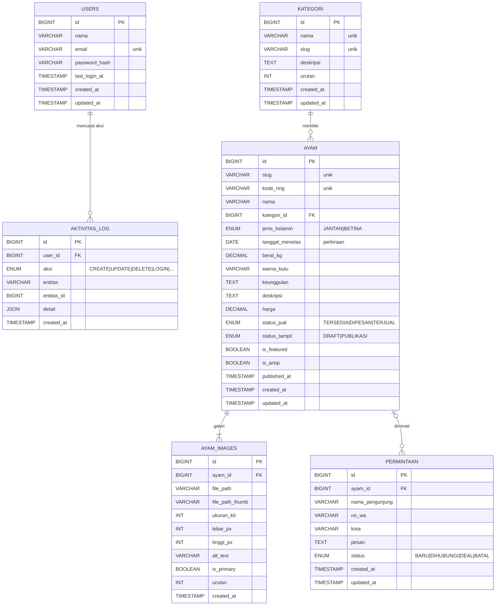

# Entity Relationship Diagram (ERD)
## Jalu — Galeri Ayam Bangkok

| | |
|---|---|
| **Versi** | 2.0 (revisi: tanggal menetas, tanpa kota asal, akun pemilik tunggal) |
| **Tanggal** | 2 September 2026 |
| **Lampiran** | DDL lengkap → [`schema.sql`](schema.sql) · diagram vektor → [`diagrams/erd.svg`](diagrams/erd.svg) |

---

## 1. Gambaran Umum

Enam entitas inti:

```
users (pemilik)   ← ayam?   ✗  — ayam TIDAK mencatat pembuat (satu pemilik)
users → aktivitas_log  (siapa mencatat perubahan)
kategori →  ayam   (1 kategori banyak ayam)
ayam  →  ayam_images (galeri foto, 1 ayam banyak gambar)
ayam  ← permintaan (pengunjung "tertarik" pada ayam tertentu)
```

Karena **satu peternakan dengan satu pemilik/pengelola**, entitas `users` hanya berisi akun pemilik — tidak ada peran (role) maupun kolom `created_by` pada ayam. Pengunjung berinteraksi lewat form publik yang masuk ke tabel `permintaan`.

---

## 2. Diagram ER (Mermaid)



> 💡 Jika pembaca Markdown Anda tidak merender Mermaid, buka **`docs/diagrams/erd.svg`** untuk versi gambar/vektor, atau **`schema.sql`** untuk DDL pasti.

---

## 3. Deskripsi Entitas & Atribut

### 3.1 `users` — Akun pemilik (tunggal)

| Kolom | Tipe | Ketentuan | Catatan |
|---|---|---|---|
| id | BIGINT | PK | |
| nama | VARCHAR(100) | wajib | nama pemilik |
| email | VARCHAR(150) | wajib, unik | dipakai login |
| password_hash | VARCHAR(255) | wajib | bcrypt/argon2 |
| last_login_at | TIMESTAMP | nullable | info sesi |
| created_at / updated_at | TIMESTAMP | | |

> Tidak ada `role`/`is_active` — sistem dikelola satu orang (pemilik). Menambah pengguna lain = kebutuhan masa depan, bukan v1.

### 3.2 `kategori` — Golongan ayam

Contoh: *Bangkok Tulen, Bangkok Birma, Bangkok Thailand F1, Bangkok Lokal, Betina/Indukan.*

| Kolom | Tipe | Ketentuan | Catatan |
|---|---|---|---|
| id | BIGINT | PK | |
| nama | VARCHAR(80) | wajib, unik | |
| slug | VARCHAR(90) | wajib, unik | untuk URL & filter |
| deskripsi | TEXT | opsional | |
| urutan | INT | default 0 | urutan tampil di filter/beranda |
| created_at / updated_at | TIMESTAMP | | |

### 3.3 `ayam` — Entitas pusat katalog

| Kolom | Tipe | Ketentuan | Catatan |
|---|---|---|---|
| id | BIGINT | PK | |
| slug | VARCHAR(120) | wajib, unik | dibentuk dari kode/nama |
| kode_ring | VARCHAR(30) | opsional | nomor ring kaki; unik bila diisi |
| nama | VARCHAR(120) | wajib | nama/julukan ayam |
| kategori_id | BIGINT | **FK → kategori** (nullable) | boleh belum dikategorikan |
| jenis_kelamin | ENUM(`JANTAN`,`BETINA`) | wajib | |
| tanggal_menetas | DATE | nullable (perkiraan) | **usia dihitung otomatis** aplikasi dari tanggal ini |
| berat_kg | DECIMAL(5,2) | wajib | berat terakhir yang dicatat |
| warna_bulu | VARCHAR(80) | opsional | mis. *Hitam, dada merah tembaga* |
| keunggulan | TEXT | opsional | bullet singkat (garis bawah, pukulan…) |
| deskripsi | TEXT | opsional | catatan kandang |
| harga | DECIMAL(12,0) | nullable | **NULL = "Hubungi kami"** |
| status_jual | ENUM(`TERSEDIA`,`DIPESAN`,`TERJUAL`) | wajib | alur: tersedia→dipesan→terjual |
| status_tampil | ENUM(`DRAFT`,`PUBLIKASI`) | wajib | draft disembunyikan dari publik |
| is_featured | BOOLEAN | default 0 | unggulan beranda, maks. 3 |
| is_arsip | BOOLEAN | default 0 | soft-delete |
| published_at | TIMESTAMP | nullable | kapan dipublikasikan |
| created_at / updated_at | TIMESTAMP | | |

> **Alasan desain:** umur **tidak disimpan** sebagai angka (mis. "18 bulan") karena cepat usang. Yang disimpan adalah `tanggal_menetas`; tampilan usia ("± X bulan") dihitung aplikasi pada saat render sehingga **selalu terbaru**. Jika tanggal menetas kosong, usia tidak ditampilkan.
> Kolom `asal` (kota) **tidak ada**: satu peternakan, satu lokasi. Lokasi kandang cukup dituliskan di halaman "Tentang".

### 3.4 `ayam_images` — Galeri foto (satu ayam → banyak gambar)

| Kolom | Tipe | Ketentuan | Catatan |
|---|---|---|---|
| id | BIGINT | PK | |
| ayam_id | BIGINT | **FK → ayam**, wajib | |
| file_path | VARCHAR(255) | wajib | path relatif file asli (di luar folder publik di produksi) |
| file_path_thumb | VARCHAR(255) | wajib | thumbnail otomatis |
| ukuran_kb | INT | opsional | |
| lebar_px / tinggi_px | INT | opsional | dimensi asli |
| alt_text | VARCHAR(255) | opsional | aksesibilitas & SEO |
| is_primary | BOOLEAN | default 0 | foto utama kartu (maks. 1 per ayam) |
| urutan | INT | default 0 | urutan galeri |
| created_at | TIMESTAMP | | |

> Aturan: tiap ayam wajib **minimal 1 gambar** sebelum dipublikasikan. Bila foto utama dihapus, gambar berikutnya naik menjadi utama.

### 3.5 `permintaan` — Form "Saya Tertarik" (dikirim pengunjung via web)

| Kolom | Tipe | Ketentuan | Catatan |
|---|---|---|---|
| id | BIGINT | PK | |
| ayam_id | BIGINT | **FK → ayam** (nullable) | tetap tersimpan bila ayam dihapus |
| nama_pengunjung | VARCHAR(120) | wajib | |
| no_wa | VARCHAR(25) | wajib | nomor untuk dihubungi balik |
| kota | VARCHAR(100) | opsional | domisili **pembeli** (boleh beda kota — ini data pelanggan, bukan asal ayam) |
| pesan | TEXT | opsional | |
| status | ENUM(`BARU`,`DIHUBUNGI`,`DEAL`,`BATAL`) | wajib | dikelola pemilik di panel |
| created_at / updated_at | TIMESTAMP | | |

### 3.6 `aktivitas_log` — Jejak perubahan

| Kolom | Tipe | Ketentuan | Catatan |
|---|---|---|---|
| id | BIGINT | PK | |
| user_id | BIGINT | **FK → users** (nullable) | pelaku (pemilik) |
| aksi | ENUM(`LOGIN`,`CREATE`,`UPDATE`,`DELETE`,`ARSIP`,`PULIHKAN`,`UBAH_STATUS`,`LAINNYA`) | wajib | |
| entitas | VARCHAR(50) | wajib | mis. `ayam`, `ayam_images`, `permintaan` |
| entitas_id | BIGINT | nullable | id objek |
| detail | JSON | opsional | ringkasan perubahan |
| created_at | TIMESTAMP | | |

> Log bersifat *append-only* di aplikasi; membantu pemilik melihat kembali perubahan yang pernah dilakukan.

---

## 4. Keputusan Relasi & Catatan Desain

1. **`ayam.kategori_id` nullable & `ON DELETE SET NULL`** → kategori terhapus tidak menghapus ayam.
2. **`ayam_images.ayam_id` `ON DELETE CASCADE`** → menghapus ayam menghapus baris gambarnya; file fisik dihapus oleh aplikasi agar tidak ada file yatim.
3. **`permintaan.ayam_id` nullable & `ON DELETE SET NULL`** → riwayat minat tidak hilang walau ayam dihapus permanen.
4. **`users` terhubung hanya ke `aktivitas_log`** → karena satu pemilik, ayam/permintaan tidak mencatat `created_by`.
5. **Usia = turunan dari `tanggal_menetas`** (komputasi saat tampil), bukan kolom `umur` agar tidak basi.
6. Harga bertipe `DECIMAL` (bukan float); tampilan memakai pemisah ribuan (`Rp 3.500.000`).
7. **Indeks** untuk query yang sering: status publikasi, kategori, status jual, tanggal menetas; unik pada `email`, `slug`, `kode_ring` (jika terisi).

---

## 5. Cek Kesesuaian Kebutuhan (traceability)

| Entitas | Mendukung kebutuhan |
|---|---|
| users (pemilik) | Login pengelola tunggal (PRD AF-01) |
| kategori | Filter & kelompok ayam (PF-03, AF-06) |
| ayam + tanggal_menetas + status_jual + is_featured | Display katalog, usia otomatis & info penjualan (PF-01..04, AF-03) |
| ayam_images | Galeri multi-foto & foto utama (PF-04, AF-04) |
| permintaan | Form "Saya Tertarik" (PF-05, AF-07) |
| aktivitas_log | Log perubahan (AF-08) |

---
*Bersama [`schema.sql`](schema.sql) sebagai sumber DDL definitif.*
