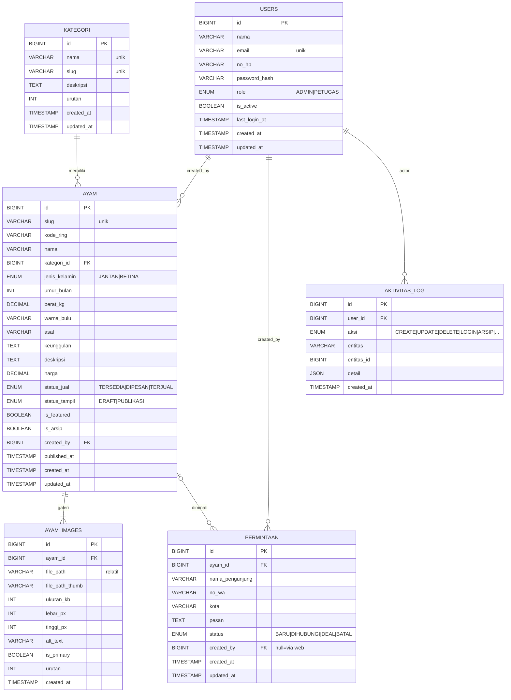

# Entity Relationship Diagram (ERD)
## Jalu — Galeri Ayam Bangkok

| | |
|---|---|
| **Versi** | 1.0 |
| **Tanggal** | 2 September 2026 |
| **Lampiran** | DDL lengkap → [`schema.sql`](schema.sql) · diagram vektor → [`diagrams/erd.svg`](diagrams/erd.svg) |

---

## 1. Gambaran Umum

Enam entitas inti:

```
users  →  ayam  →  ayam_images  (galeri foto, 1 ayam punya banyak gambar)
kategori →  ayam  (1 kategori banyak ayam)
ayam ← permintaan  (pengunjung "tertarik" pada ayam tertentu)
users → permintaan / aktivitas_log  (siapa mencatat/melakukan aksi)
```

Relasi dirancang **longgar (nullable di sisi anak)** agar data tetap aman bila entitas induk terhapus (lihat §4 "keputusan relasi").

---

## 2. Diagram ER (Mermaid)



> 💡 Jika pembaca Markdown Anda tidak merender Mermaid, buka **`docs/diagrams/erd.svg`** untuk versi gambar/vektor, atau lihat **`schema.sql`** untuk DDL pasti.

---

## 3. Deskripsi Entitas & Atribut

### 3.1 `users` — Pengguna sistem (admin & petugas)

| Kolom | Tipe | Ketentuan | Catatan |
|---|---|---|---|
| id | BIGINT | PK, auto | |
| nama | VARCHAR(100) | wajib | nama tampilan |
| email | VARCHAR(150) | wajib, **unik** | dipakai login |
| no_hp | VARCHAR(25) | opsional | kontak petugas |
| password_hash | VARCHAR(255) | wajib | bcrypt/argon2 |
| role | ENUM(`ADMIN`,`PETUGAS`) | wajib | admin vs petugas (§PRD 3.1) |
| is_active | BOOLEAN | default 1 | nonaktif → tidak bisa login |
| last_login_at | TIMESTAMP | nullable | info dashboard |
| created_at / updated_at | TIMESTAMP | wajib | |

### 3.2 `kategori` — Golongan ayam

Contoh data: *Bangkok Tulen, Bangkok Birma, Bangkok Thailand (F1), Bangkok Lokal, Ayam Betina/Indukan.*

| Kolom | Tipe | Ketentuan | Catatan |
|---|---|---|---|
| id | BIGINT | PK | |
| nama | VARCHAR(80) | wajib, unik | |
| slug | VARCHAR(90) | wajib, unik | untuk URL & filter |
| deskripsi | TEXT | opsional | |
| urutan | INT | default 0 | urutan tampil di filter/beranda |
| created_at / updated_at | TIMESTAMP | | |

### 3.3 `ayam` — Entitas pusat katalog

| Kolom | Tipe | Ketentuan | Catatan |
|---|---|---|---|
| id | BIGINT | PK | |
| slug | VARCHAR(120) | wajib, unik | dibentuk dari kode/nama |
| kode_ring | VARCHAR(30) | opsional | nomor ring kaki; unik bila diisi |
| nama | VARCHAR(120) | wajib | nama/julukan ayam |
| kategori_id | BIGINT | **FK → kategori** (nullable) | boleh belum dikategorikan |
| jenis_kelamin | ENUM(`JANTAN`,`BETINA`) | wajib | |
| umur_bulan | INT | wajib | ditampilkan "± X bulan" |
| berat_kg | DECIMAL(5,2) | wajib | contoh `3.40` |
| warna_bulu | VARCHAR(80) | opsional | mis. *Hitam, dada merah tembaga* |
| asal | VARCHAR(120) | opsional | mis. *Blitar, Jawa Timur* |
| keunggulan | TEXT | opsional | bullet singkat (garis bawah, pukulan…) |
| deskripsi | TEXT | opsional | cerita lebih panjang |
| harga | DECIMAL(12,0) | nullable | **NULL = "Hubungi kami"** (aturan bisnis §5) |
| status_jual | ENUM(`TERSEDIA`,`DIPESAN`,`TERJUAL`) | wajib | alur: tersedia→dipesan→terjual |
| status_tampil | ENUM(`DRAFT`,`PUBLIKASI`) | wajib | draft disembunyikan dari publik |
| is_featured | BOOLEAN | default 0 | unggulan beranda, **maks. 3** |
| is_arsip | BOOLEAN | default 0 | soft-delete (petugas & admin) |
| created_by | BIGINT | **FK → users** (nullable) | pembuat data |
| published_at | TIMESTAMP | nullable | kapan dipublikasikan |
| created_at / updated_at | TIMESTAMP | | |

### 3.4 `ayam_images` — Galeri foto (satu ayam → banyak gambar)

| Kolom | Tipe | Ketentuan | Catatan |
|---|---|---|---|
| id | BIGINT | PK | |
| ayam_id | BIGINT | **FK → ayam**, wajib | |
| file_path | VARCHAR(255) | wajib | path relatif file asli (diluar folder aplikasi di produksi) |
| file_path_thumb | VARCHAR(255) | wajib | thumbnail otomatis |
| ukuran_kb | INT | opsional | informasi |
| lebar_px / tinggi_px | INT | opsional | dimensi asli |
| alt_text | VARCHAR(255) | opsional | aksesibilitas & SEO |
| is_primary | BOOLEAN | default 0 | foto utama kartu (maks. 1 per ayam) |
| urutan | INT | default 0 | urutan di galeri |
| created_at | TIMESTAMP | | |

> Aturan: tiap ayam wajib **minimal 1 gambar** sebelum dipublikasikan (business rule §5 PRD). Saat gambar utama dihapus, gambar urutan berikutnya naik sebagai utama.

### 3.5 `permintaan` — Form "Saya Tertarik" dari pengunjung

| Kolom | Tipe | Ketentuan | Catatan |
|---|---|---|---|
| id | BIGINT | PK | |
| ayam_id | BIGINT | **FK → ayam** (nullable) | jika ayam dihapus, permintaan tetap tersimpan |
| nama_pengunjung | VARCHAR(120) | wajib | |
| no_wa | VARCHAR(25) | wajib | nomor untuk dihubungi balik |
| kota | VARCHAR(100) | opsional | |
| pesan | TEXT | opsional | penawaran/pertanyaan |
| status | ENUM(`BARU`,`DIHUBUNGI`,`DEAL`,`BATAL`) | wajib | dikelola di panel |
| created_by | BIGINT | **FK → users** (nullable) | terisi bila petugas input manual; NULL bila dari web publik |
| created_at / updated_at | TIMESTAMP | | |

### 3.6 `aktivitas_log` — Jejak audit ringan

| Kolom | Tipe | Ketentuan | Catatan |
|---|---|---|---|
| id | BIGINT | PK | |
| user_id | BIGINT | **FK → users** (nullable) | pelaku; NULL untuk aksi anonim |
| aksi | ENUM(`LOGIN`,`CREATE`,`UPDATE`,`DELETE`,`ARSIP`,`PULIHKAN`,`UBAH_STATUS`,`KELOLA_USER`,…) | wajib | |
| entitas | VARCHAR(50) | wajib | nama tabel/objek, mis. `ayam`, `ayam_images`, `permintaan` |
| entitas_id | BIGINT | nullable | id objek |
| detail | JSON | opsional | ringkasan perubahan (nilai lama→baru) |
| created_at | TIMESTAMP | | |

> Log **tidak dapat diubah/dihapus oleh petugas** (hanya admin, dan sebaiknya append-only di aplikasi).

---

## 4. Keputusan Relasi & Catatan Desain

1. **`ayam.kategori_id` nullable & `ON DELETE SET NULL`** → kategori yang terhapus tidak ikut menghapus ayam; ayam cukup "tanpa kategori".
2. **`ayam.created_by` nullable & `ON DELETE SET NULL`** → jika akun pengguna dihapus, riwayat data ayam tetap utuh.
3. **`ayam_images.ayam_id` dengan `ON DELETE CASCADE`** → menghapus ayam pasti menghapus gambar barisnya; file fisik dihapus oleh kode aplikasi agar tidak ada file yatim.
4. **`permintaan.ayam_id` nullable & `ON DELETE SET NULL`** → riwayat minat tidak hilang walau ayam dihapus permanen.
5. **`users` dapat berstatus nonaktif** (soft) — akun jarang dihapus permanen; log mencatat user_id walau akun dinonaktifkan.
6. **Status dijaga di level aplikasi** (alur jual + rule §5 PRD), bukan murni constraint DB, supaya pesan kesalahan ramah.
7. Harga bertipe `DECIMAL` (bukan float) agar akurat untuk Rupiah; tampilan memakai pemisah ribuan (`Rp3.500.000`).
8. **Indeks** (lihat `schema.sql`) untuk query yang sering: status publikasi, kategori, status jual, tanggal; unik pada `email`, `slug`, `kode_ring` (jika terisi).

---

## 5. Cek Kesesuaian Kebutuhan (traceability)

| Entitas | Mendukung kebutuhan |
|---|---|
| users, role | Multi-user admin/petugas (PRD AF-01, AF-08) |
| kategori | Filter & kelompok ayam (PF-03, AF-06) |
| ayam + status_jual + is_featured | Display katalog + info penjualan (PF-01..04, AF-03) |
| ayam_images | Galeri multi-foto & foto utama (PF-04, AF-04) |
| permintaan | Form "Saya Tertarik" (PF-05, AF-07) |
| aktivitas_log | Log aktivitas admin (AF-09) |

---
*Bersama [`schema.sql`](schema.sql) sebagai sumber DDL definitif.*
